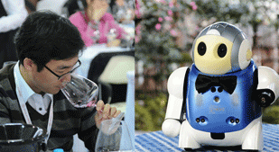
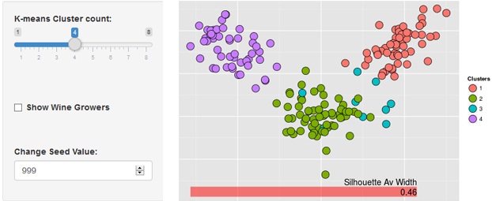
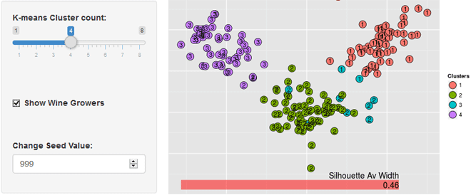

--- 
title       : Machine Wine Tasting
subtitle    : For Coursera Developing Data Products
author      : Ron Segal
job         : Digital Analyst
framework   : io2012        # {io2012, html5slides, shower, dzslides, ...}
highlighter : highlight.js  # {highlight.js, prettify, highlight}
hitheme     : tomorrow      # 
widgets     : []            # {mathjax, quiz, bootstrap}
mode        : selfcontained # {standalone, draft}
knit        : slidify::knit2slides
--- .class #id1 bg:#FFDADA


## <p style="color:darkred;font-size:48px;">Machine Wine "Tasting"</p>

<figure style="float:left;">

<figcaption  style="font-size:12px;text-align:center;">Wine Tasting - Man vs Machine</figcaption>
</figure>
The purpose of the application is to interactively explore aspects of the k-means clustering, unsupervised learning algorithm in a wine "tasting" scenario. It runs the algorithm on a dataset of 13 chemicals analysed from 177 wine samples, cultivated in Italy by 3 different growers.

* The application provides an interactive slider to set the number of k-means clusters.
* The results are immediately displayed in a scatterplot with the set number of clusters.
* A two dimensional plot is achieved by linear dimension reduction using discrproj (R package fpc).
<figure style="float:right;">

</figure>
* The actual grower for each wine sample can be revealed for comparison with the k-means clusters.


--- .class #id1 bg:#FFDADA

## <p style="color:darkred;font-size:48px;">Growers and Silhouette</p>


* In the screen shot of the application shown below, the clusters do indeed allocate wines quite well to growers, although the blue cluster looks doubtful.
* The Machine Wine "Tasting" k-means clustering application uses Silhouette
* Silhouette is a method of interpretation and validation of consistency within clusters of data
* The average Silhouette width over all data of the entire dataset is one kind of measure of how appropriately the data has been clustered. The greater the width the better.
* The Machine Wine "Tasting" application indicates average Silhouette values by a red band, as in the figure.
<figure style="float:right;">

</figure>

--- .class #id1 bg:#FFDADA &twocol

## <p style="color:darkred;font-size:48px;">The "Lost" Plot</p>
*** =left
* Although the application shows average Silhouette width it doesn't provide a Silhouette plot. 
* A Silhouette plot has been generated here, based on 4 k-means clusters.
* From the previous scatterplot it is perhaps not surprising that one of the clusters has a negative width, indicative of a poor fit.
* In the next version of the application we plan to show Silhouette plots
* The application can be found at: https://ronsegal.shinyapps.io/mlwines

*** =right
``` {r, echo = FALSE, message=FALSE, warning=FALSE}

options(rgl.useNULL=TRUE) #fixes a warning message
library(cluster)
library(HSAUR)

winedata<-read.csv("assets/data/wine.data", sep=",")
# Wine data from: http://archive.ics.uci.edu/ml/datasets/Wine

# Most of these variable names aren't actually used in the code below
names(winedata)<- c("Type","Alcohol","Malic", "Ash", "Alcalinity", "Magnesium", "Phenols", "Flavanoids", "Nonflavanoids", "Proanthocyanins", "Colorintensity", "Hue", "Dilution", "Proline")  

wines<-winedata
wines$Type<-NULL    # Remove the 'Type' variable for 3 growers, i.e. values 1,2, or 3
wines<-scale(wines) # Normalise the scale of the independent variables
totalClusters<-4
km <<- kmeans(wines,totalClusters)
       # Run silhouette model to identify number of clusters
       # that achieve best fit as indicated by average width
       dissE <- daisy(wines) 
       dE2   <- dissE^2
       sk2   <- silhouette(km$cl, dE2)
       plot(sk2, col="darkred")

```


