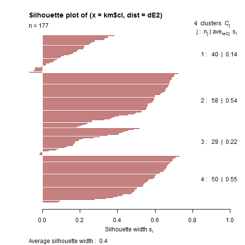

--- 
title       : Machine Wine Tasting
subtitle    : For Coursera Developing Data Products
author      : Ron Segal
job         : Digital Analyst
framework   : io2012        # {io2012, html5slides, shower, dzslides, ...}
highlighter : highlight.js  # {highlight.js, prettify, highlight}
hitheme     : tomorrow      # 
widgets     : []            # {mathjax, quiz, bootstrap}
mode        : selfcontained # {standalone, draft}
knit        : slidify::knit2slides
--- .class #id1 bg:#FFDADA

## 
Machine Wine "Tasting"

<figure style="float:left;">

<figcaption  style="font-size:12px;text-align:center;">Wine Tasting - Man vs Machine</figcaption>
</figure>
The purpose of the application is to interactively explore aspects of the k-means clustering, unsupervised learning algorithm in a wine "tasting" scenario. It runs the algorithm on a dataset of 13 chemicals analysed from 177 wine samples, cultivated in Italy by 3 different growers.

* The application provides an interactive slider to set the number of k-means clusters.
* The results are immediately displayed in a scatterplot with the set number of clusters.
* A two dimensional plot is achieved by linear dimension reduction using discrproj (R package fpc).
<figure style="float:right;">

</figure>
* The actual grower for each wine sample can be revealed for comparison with the k-means clusters.

--- .class #id1 bg:#FFDADA

## 
Growers and Silhouette

* In the screen shot of the application shown below, the clusters do indeed allocate wines quite well to growers, although the blue cluster looks doubtful.
* The Machine Wine "Tasting" k-means clustering application uses Silhouette
* Silhouette is a method of interpretation and validation of consistency within clusters of data
* The average Silhouette width over all data of the entire dataset is one kind of measure of how appropriately the data has been clustered. The greater the width the better.
* The Machine Wine "Tasting" application indicates average Silhouette values by a red band, as in the figure.
<figure style="float:right;">

</figure>

--- .class #id1 bg:#FFDADA &twocol

## 
The "Lost" Plot

*** =left
* Although the application shows average Silhouette width it doesn't provide a Silhouette plot. 
* A Silhouette plot has been generated here, based on 4 k-means clusters.
* From the previous scatterplot it is perhaps not surprising that one of the clusters has a negative width, indicative of a poor fit.
* In the next version of the application we plan to show Silhouette plots
* The application can be found at: https://ronsegal.shinyapps.io/mlwines

*** =right
 

